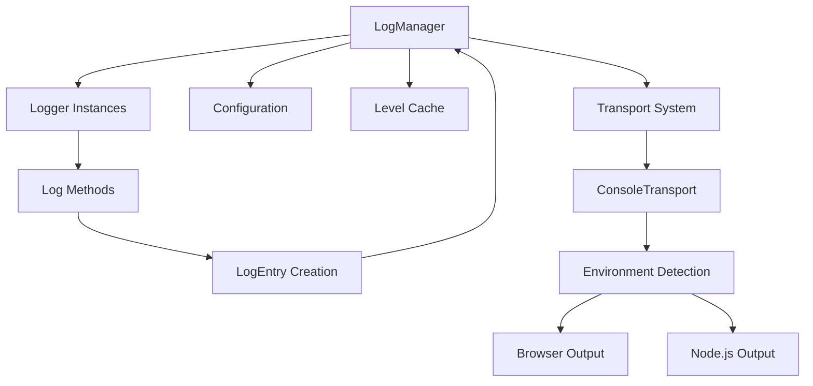

# Design Document

## Overview

The `@hatchgrid/logger` package is designed as a universal TypeScript logging library that provides hierarchical logging capabilities with environment-aware output formatting. The design follows the established patterns in the Hatchgrid monorepo, using modern ES modules, TypeScript strict mode, and zero external dependencies.

The architecture is inspired by mature Java logging frameworks like SLF4J and Log4j, adapted for JavaScript/TypeScript environments. The core design principle is performance-first logging with lazy evaluation and efficient caching mechanisms.

## Architecture

### Core Components



### Design Patterns

1. **Singleton Pattern**: LogManager serves as the central configuration and logger factory
2. **Factory Pattern**: LogManager creates and caches Logger instances
3. **Strategy Pattern**: Transport system allows pluggable output destinations
4. **Flyweight Pattern**: Logger instances are cached and reused
5. **Template Method Pattern**: ConsoleTransport uses different formatting strategies per environment

## Components and Interfaces

### LogManager (Singleton)

The LogManager is the central authority responsible for:
- Configuration management
- Logger instance creation and caching
- Log level resolution with hierarchy support
- Log entry processing and routing to transports

```typescript
class LogManager {
  private static config: LoggerConfiguration | null = null;
  private static loggers = new Map<string, Logger>();
  private static levelCache = new Map<string, LogLevel>();

  static configure(config: LoggerConfiguration): void
  static getLogger(name: string): Logger
  static processLog(entry: LogEntry): void
  private static getEffectiveLevel(name: string): LogLevel
}
```

**Key Design Decisions:**
- Static methods for global access without instantiation
- Separate caching for loggers and effective levels for performance
- Lazy level resolution with caching to avoid repeated hierarchy traversal

### Logger (Instance)

Logger instances provide the developer-facing API with methods for each log level:

```typescript
class Logger {
  constructor(public readonly name: string)

  trace(message: string, ...args: unknown[]): void
  debug(message: string, ...args: unknown[]): void
  info(message: string, ...args: unknown[]): void
  warn(message: string, ...args: unknown[]): void
  error(message: string, ...args: unknown[]): void
  fatal(message: string, ...args: unknown[]): void

  private log(level: LogLevel, message: string, args: unknown[]): void
}
```

**Key Design Decisions:**
- Immutable logger name for identity
- Single private log method to centralize entry creation
- Direct delegation to LogManager for processing

### Transport System

The transport system uses a simple interface to allow extensibility:

```typescript
interface Transport {
  log(entry: LogEntry): void;
}

interface LogEntry {
  timestamp: Date;
  level: LogLevel;
  loggerName: string;
  message: string;
  args: unknown[];
}
```

### ConsoleTransport (Universal)

The ConsoleTransport implements environment-aware formatting:

```typescript
class ConsoleTransport implements Transport {
  log(entry: LogEntry): void
  private logToBrowser(entry: LogEntry): void
  private logToNode(entry: LogEntry): void
  private getConsoleMethod(level: LogLevel): (...data: any[]) => void
}
```

**Environment Detection Strategy:**
```typescript
const isBrowser = typeof window !== 'undefined' && typeof window.document !== 'undefined';
```

**Browser Formatting:**
- Uses CSS styles with `%c` placeholders for colored output
- Leverages console.info, console.warn, console.error for appropriate browser dev tools categorization
- Structured format: `timestamp [LEVEL] loggerName message ...args`

**Node.js Formatting:**
- Uses ANSI escape codes for terminal colors
- Same console method mapping as browser
- Includes JSON formatting for complex arguments

## Data Models

### LogLevel Enum

```typescript
enum LogLevel {
  TRACE = 0,
  DEBUG = 1,
  INFO = 2,
  WARN = 3,
  ERROR = 4,
}
```

**Design Rationale:**
- Numeric values enable efficient comparison operations
- Standard severity levels familiar to developers
- Ascending order allows simple `>=` comparisons for level filtering

### LoggerConfiguration

```typescript
interface LoggerConfiguration {
  level: LogLevel;                           // Root level
  levels?: { [name: string]: LogLevel };     // Hierarchical overrides
  transports: Transport[];                   // Output destinations
}
```

**Hierarchical Level Resolution:**
- Supports dot-notation hierarchies (e.g., "api.services.auth")
- Parent levels apply to children unless overridden
- Caching prevents repeated hierarchy traversal
- Root level serves as fallback

### Package Structure

Following monorepo conventions established by `@hatchgrid/utilities`:

```
client/packages/logger/
├── src/
│   ├── index.ts                 # Public API exports
│   ├── types.ts                 # Type definitions and enums
│   ├── Logger.ts                # Logger class implementation
│   ├── LogManager.ts            # Singleton manager
│   └── transports/
│       └── ConsoleTransport.ts  # Universal console output
├── package.json                 # Package configuration
├── tsconfig.json               # TypeScript configuration
├── tsconfig.build.json         # Build-specific TypeScript config
└── vite.config.ts              # Build configuration
```

## Error Handling

### Graceful Degradation Strategy

1. **Missing Configuration**: If LogManager.configure() is not called, all log operations are silently ignored
2. **Transport Failures**: Individual transport failures don't affect other transports
3. **Invalid Log Levels**: Type system prevents invalid levels at compile time
4. **Environment Detection**: Falls back to Node.js formatting if browser detection fails

### Error Boundaries

```typescript
// In LogManager.processLog()
if (!this.config) return; // Graceful degradation

// In transport processing
this.config.transports.forEach(transport => {
  try {
    transport.log(entry);
  } catch (error) {
    // Log transport errors to console.error to avoid infinite loops
    console.error('Logger transport error:', error);
  }
});
```

## Testing Strategy

### Unit Testing Approach

1. **LogManager Tests**:
   - Configuration handling
   - Logger instance caching
   - Hierarchical level resolution
   - Level cache behavior

2. **Logger Tests**:
   - Method delegation to LogManager
   - Argument passing
   - Level-specific method behavior

3. **ConsoleTransport Tests**:
   - Environment detection
   - Browser vs Node.js output formatting
   - Console method selection
   - CSS and ANSI formatting

4. **Integration Tests**:
   - End-to-end logging flow
   - Multiple transport coordination
   - Performance characteristics

### Test Environment Setup

```typescript
// Mock environment detection for testing
const mockBrowser = () => {
  global.window = { document: {} } as any;
};

const mockNode = () => {
  delete (global as any).window;
};
```

### Performance Testing

- Benchmark level checking performance with large hierarchies
- Measure memory usage with many cached loggers
- Test log message creation overhead when levels are disabled

## Performance Optimizations

### Level Checking Optimization

```typescript
// Fast path: check effective level before creating LogEntry
const effectiveLevel = this.getEffectiveLevel(loggerName);
if (level < effectiveLevel) return; // Skip entirely
```

### Caching Strategy

1. **Logger Instance Cache**: Prevents repeated object creation
2. **Effective Level Cache**: Avoids hierarchy traversal on every log call
3. **Cache Invalidation**: Clear level cache when configuration changes

### Memory Management

- WeakMap consideration for logger cache (decided against due to string keys)
- Bounded cache size for production environments (future enhancement)
- Lazy initialization of expensive resources

## Integration with Monorepo

### Package Configuration

Following `@hatchgrid/utilities` patterns:

```json
{
  "name": "@hatchgrid/logger",
  "type": "module",
  "main": "./dist/logger.js",
  "module": "./dist/logger.js",
  "types": "./dist/index.d.ts",
  "exports": {
    ".": {
      "types": "./dist/index.d.ts",
      "import": "./dist/logger.js"
    }
  }
}
```

### Build Configuration

- Uses Vite for bundling with TypeScript declaration generation
- Extends `@hatchgrid/tsconfig/tsconfig.base.json`
- Outputs ES modules compatible with both Node.js and browsers
- Generates proper TypeScript declarations for IDE support

### Usage in Applications

```typescript
// In application entry point (e.g., main.ts)
import { LogManager, LogLevel, ConsoleTransport } from '@hatchgrid/logger';

LogManager.configure({
  level: import.meta.env.PROD ? LogLevel.INFO : LogLevel.DEBUG,
  levels: {
    'api.database': LogLevel.WARN,
    'ui.animation': LogLevel.ERROR,
  },
  transports: [new ConsoleTransport()],
});

// In application modules
import { LogManager } from '@hatchgrid/logger';
const logger = LogManager.getLogger('api.services.auth');
```

### Development Workflow

1. **Development**: DEBUG level with detailed console output
2. **Production**: INFO level with structured logging
3. **Testing**: Configurable levels per test suite
4. **CI/CD**: ERROR level to reduce noise in build logs

This design provides a solid foundation for universal logging while maintaining the performance and architectural principles established in the Hatchgrid monorepo.
