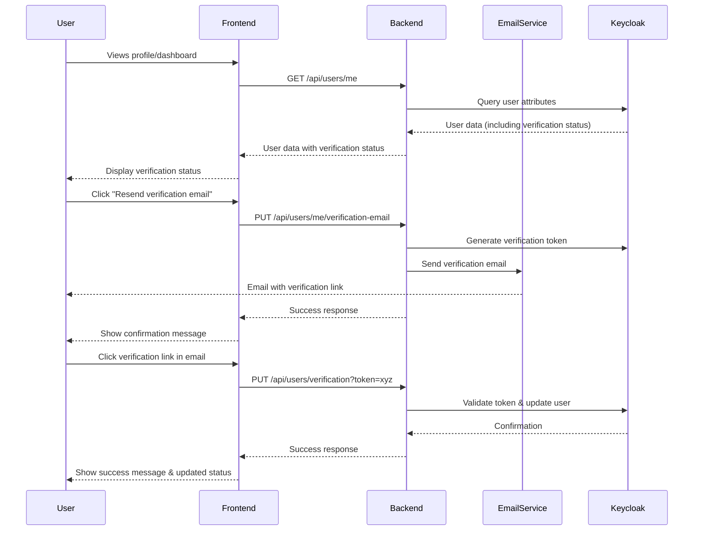

# Email Verification Flow Design Document

## Overview

The Email Verification Flow feature implements a comprehensive system for verifying user email addresses in the Hatchgrid platform. This design document outlines the architecture, components, data models, and implementation strategy for both frontend and backend aspects of the feature.

The system will allow users to view their verification status, request new verification emails, and complete the verification process by clicking on links sent to their email. The implementation will follow security best practices and integrate with the existing authentication system.

## Architecture

The Email Verification Flow will follow the existing BFF (Backend For Frontend) architecture pattern used in the Hatchgrid platform. This means:

1. The frontend (Vue.js application) will communicate with our Spring Boot backend
2. The backend will handle all interactions with Keycloak (the identity provider)
3. The frontend will never directly communicate with Keycloak

### High-Level Flow



## Components and Interfaces

### Frontend Components

1. **VerificationStatusComponent**
   - Displays the current verification status
   - Shows appropriate UI based on verification state
   - Includes the "Resend verification email" button for unverified users

2. **VerificationPageComponent**
   - Handles the verification process when users click the link from their email
   - Displays success/error messages based on verification result
   - Provides navigation back to the main application

3. **UserProfileComponent** (enhancement)
   - Add verification status display to existing profile component
   - Integrate with VerificationStatusComponent

### Backend Components

1. **UserVerificationController**
   - Endpoints for checking verification status
   - Endpoint for requesting new verification emails
   - Endpoint for verifying email tokens

2. **UserVerificationService**
   - Business logic for email verification
   - Token generation and validation
   - Integration with Keycloak

3. **EmailService** (enhancement)
   - Add support for verification email templates
   - Handle email sending for verification

### API Endpoints

#### GET /api/users/me

- Returns user profile including email verification status
- Response includes `emailVerified` boolean field

#### PUT /api/users/me/verification-email

- Triggers sending a new verification email
- Rate limited to prevent abuse
- Returns 200 OK on success

#### PUT /api/users/verification

- Accepts verification token as query parameter
- Validates token and updates user status
- Returns appropriate success/error response

## Data Models

### User Model Enhancement

Based on the existing User domain model:

```kotlin
// Enhancement to the existing User domain model
data class User(
    override val id: UserId,
    val email: Email,
    val username: Username = Username(email.value),
    var name: Name? = null,
    val credentials: MutableList<Credential> = mutableListOf(),
    val emailVerified: Boolean = false // Added field for verification status
) : AggregateRoot<UserId>() {
    // Existing methods...
}
```

And enhancement to the UserResponse:

```kotlin
data class UserResponse(
    val username: String,
    val email: String,
    val firstname: String?,
    val lastname: String?,
    val authorities: Set<String> = emptySet(),
    val emailVerified: Boolean = false // Added field for verification status
) : Serializable {
    companion object {
        private const val serialVersionUID = 1L
    }
}
```

### Verification Token Model

```kotlin
data class VerificationToken(
    val token: String,
    val userId: UUID,
    val expiresAt: Instant,
    val used: Boolean
)
```

### API Request/Response Models

```kotlin
// For resending verification email
data class ResendVerificationEmailResponse(
    val success: Boolean,
    val message: String
)

// For verifying email
data class VerifyEmailRequest(
    val token: String
)

data class VerifyEmailResponse(
    val success: Boolean,
    val message: String
)
```

## Error Handling

### Frontend Error Handling

1. Display user-friendly error messages for common scenarios:
   - Invalid/expired verification token
   - Rate limiting for verification email requests
   - Network errors

2. Implement appropriate retry mechanisms for transient errors

### Backend Error Handling

1. Define specific exception types:
   - `VerificationTokenExpiredException`
   - `VerificationTokenInvalidException`
   - `VerificationRateLimitedException`

2. Map exceptions to appropriate HTTP status codes:
   - 400 Bad Request for invalid tokens
   - 404 Not Found for non-existent tokens
   - 429 Too Many Requests for rate limiting

3. Implement comprehensive logging for security auditing

## Testing Strategy

### Frontend Testing

1. **Unit Tests**:
   - Test VerificationStatusComponent rendering in different states
   - Test VerificationPageComponent token handling
   - Test API service methods with mocked responses

2. **Component Tests**:
   - Test user interactions (clicking buttons, form submissions)
   - Test proper display of success/error messages

### Backend Testing

1. **Unit Tests**:
   - Test UserVerificationService methods
   - Test token generation and validation
   - Test exception handling

2. **Integration Tests**:
   - Test API endpoints with mock Keycloak responses
   - Test complete verification flow
   - Test error scenarios and edge cases

3. **Security Tests**:
   - Test token expiration handling
   - Test rate limiting functionality
   - Test against common security vulnerabilities

## Implementation Considerations

### Security Considerations

1. **Token Security**:
   - Use cryptographically secure random tokens
   - Implement appropriate token expiration (24-48 hours recommended)
   - Ensure one-time use only

2. **Rate Limiting**:
   - Implement per-user rate limiting for verification email requests
   - Suggested limit: 3 requests per hour

3. **Email Security**:
   - Use secure links with HTTPS
   - Don't include sensitive information in emails

### User Experience Considerations

1. **Clear Status Indicators**:
   - Use color and icons to indicate verification status
   - Provide clear calls-to-action for unverified users

2. **Helpful Messaging**:
   - Explain the importance of verification
   - Provide troubleshooting tips if users don't receive emails

3. **Seamless Flow**:
   - Minimize friction in the verification process
   - Provide immediate feedback on actions

### Integration with Existing Systems

1. **Keycloak Integration**:
   - Use Keycloak Admin API to update user attributes
   - Store verification status as a user attribute in Keycloak

2. **Email Service Integration**:
   - Use existing email service infrastructure
   - Create new email templates for verification

## Appendix

### References to Existing Code

1. User registration controller:
   - `server/thryve/src/main/kotlin/com/hatchgrid/thryve/users/infrastructure/http/UserRegisterController.kt`

2. Email verification event consumer:
   - `server/thryve/src/main/kotlin/com/hatchgrid/thryve/users/infrastructure/event/consumer/SendEmailVerification.kt`

### Technology Stack Specifics

1. **Frontend**:
   - Vue.js 3 with TypeScript
   - ShadCN Vue components for UI elements
   - Pinia for state management

2. **Backend**:
   - Spring Boot with WebFlux (reactive)
   - Spring Security with OAuth2 Resource Server
   - Keycloak for user management
