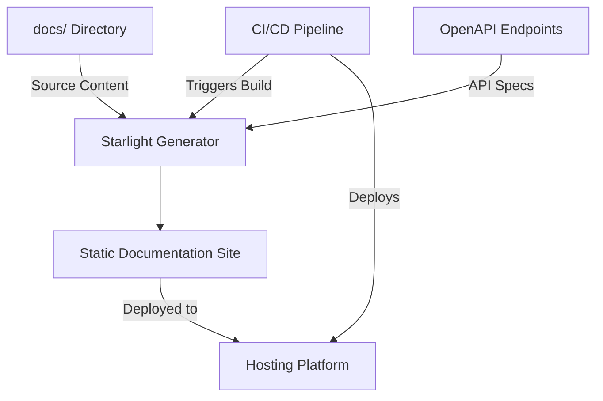

# Design Document: Starlight Documentation Integration

## Overview

This design outlines the integration of Astro's Starlight documentation framework into the Hatchgrid monorepo. The goal is to create a comprehensive, interactive documentation site that serves as a central knowledge hub for the project. The documentation site will be generated from the existing `/docs` directory, maintaining it as the single source of truth while providing a more accessible and feature-rich interface for users.

The solution will leverage Astro's Starlight starter, which provides built-in features like dark mode, full-text search, and responsive design. We'll extend this with OpenAPI/Swagger integration to provide interactive API documentation alongside conceptual content.

## Architecture

### High-Level Architecture



### Component Integration

The documentation system will be integrated into the monorepo as a new application in the client apps directory structure:

```text
client/
├── apps/
│   ├── web/               # Main Vue.js application
│   ├── landing-page/      # Astro marketing site
│   └── docs/              # NEW: Starlight documentation site
```

This placement aligns with the existing monorepo structure while keeping the documentation site as a separate deployable unit.

## Components and Interfaces

### 1. Starlight Documentation App

**Purpose**: Generate and serve the documentation site from Markdown/MDX content.

**Key Components**:

- Astro configuration with Starlight integration
- Custom theme extensions for Hatchgrid branding
- Navigation structure generator
- Search indexing system

**Configuration**:

```typescript
// astro.config.mjs
import { defineConfig } from 'astro/config';
import starlight from '@astrojs/starlight';

export default defineConfig({
  integrations: [
    starlight({
      title: 'Hatchgrid Documentation',
      logo: {
        light: './src/assets/logo-light.svg',
        dark: './src/assets/logo-dark.svg',
      },
      social: {
        github: 'https://github.com/organization/hatchgrid',
      },
      sidebar: [
        {
          label: 'Architecture',
          autogenerate: { directory: 'architecture' },
        },
        {
          label: 'Conventions',
          autogenerate: { directory: 'conventions' },
        },
        {
          label: 'API Reference',
          autogenerate: { directory: 'api' },
        },
        // Additional sections based on docs structure
      ],
      customCss: [
        './src/styles/custom.css',
      ],
      defaultLocale: 'en',
      locales: {
        en: {
          label: 'English',
        },
        // Future support for Spanish
      },
    }),
  ],
});
```

### 2. OpenAPI Integration Component

**Purpose**: Fetch, process, and display OpenAPI specifications from backend services.

**Key Components**:

- OpenAPI specification fetcher
- Swagger UI integration
- API documentation generator

**Implementation**:

- Custom Astro component for embedding Swagger UI
- Build-time fetching of OpenAPI specs from backend endpoints
- Dynamic routing for API documentation pages

```typescript
// src/components/SwaggerUI.astro
---
interface Props {
  specUrl: string;
  title?: string;
}

const { specUrl, title } = Astro.props;
---

<div class="swagger-container">
  {title && <h2>{title}</h2>}
  <div id="swagger-ui" data-spec-url={specUrl}></div>
</div>

<link rel="stylesheet" href="https://unpkg.com/swagger-ui-dist@4.5.0/swagger-ui.css" />
<script>
  import SwaggerUI from 'swagger-ui';

  document.addEventListener('DOMContentLoaded', () => {
    const container = document.getElementById('swagger-ui');
    const specUrl = container.getAttribute('data-spec-url');

    SwaggerUI({
      dom_id: '#swagger-ui',
      url: specUrl,
      deepLinking: true,
      presets: [
        SwaggerUI.presets.apis,
      ],
    });
  });
</script>
```

### 3. Content Processing Pipeline

**Purpose**: Transform and enhance documentation content during the build process.

**Key Components**:

- Markdown/MDX processor
- Code syntax highlighter
- Diagram renderer (Mermaid)
- Asset optimization

**Implementation**:

- Remark/Rehype plugins for Markdown processing
- Integration with Shiki for syntax highlighting
- Mermaid integration for diagrams

### 4. CI/CD Integration

**Purpose**: Automate the building and deployment of the documentation site.

**Key Components**:

- GitHub Actions workflow
- Build script integration
- Deployment configuration

**Implementation**:

```yaml
# .github/workflows/docs.yml
name: Build and Deploy Docs

on:
  push:
    branches: [main]
    paths:
      - 'docs/**'
      - 'client/apps/docs/**'
      - '.github/workflows/docs.yml'

jobs:
  build-and-deploy:
    runs-on: ubuntu-latest
    steps:
      - uses: actions/checkout@v3

      - name: Setup Node.js
        uses: actions/setup-node@v3
        with:
          node-version: '18'
          cache: 'pnpm'

      - name: Install dependencies
        run: pnpm install

      - name: Build documentation
        run: pnpm --filter docs build

      - name: Deploy to GitHub Pages
        uses: JamesIves/github-pages-deploy-action@v4
        with:
          folder: client/apps/docs/dist
          branch: gh-pages
```

## Data Models

### Documentation Content Structure

The documentation content will maintain its existing structure in the `/docs` directory:

```texr
docs/
├── architecture/
│   ├── hexagonal-architecture.md
│   └── ...
├── conventions/
│   ├── commit-conventions.md
│   ├── rest-api.md
│   └── ...
├── authentication/
│   └── authentication.md
├── frontend/
│   └── ...
└── ...
```

### OpenAPI Specification Model

OpenAPI specifications will be collected from backend services at build time:

```typescript
interface OpenApiSpec {
  title: string;
  version: string;
  paths: Record<string, any>;
  components: {
    schemas: Record<string, any>;
    // Other OpenAPI components
  };
  // Other OpenAPI properties
}

interface ApiDocumentation {
  serviceName: string;
  specUrl: string;
  spec: OpenApiSpec;
}
```

### Navigation Structure

The site navigation will be generated from the directory structure and frontmatter:

```typescript
interface NavItem {
  label: string;
  link?: string;
  items?: NavItem[];
  collapsed?: boolean;
}

interface Sidebar {
  [key: string]: NavItem[];
}
```

## Error Handling

### Documentation Build Errors

- Validate Markdown/MDX syntax during build
- Provide clear error messages for malformed content
- Implement fallbacks for missing content or broken links
- Log detailed build errors to CI/CD output

### OpenAPI Integration Errors

- Handle unavailable OpenAPI endpoints gracefully
- Provide fallback static API documentation when dynamic fetching fails
- Validate OpenAPI specs before rendering
- Include troubleshooting information in error displays

## Testing Strategy

### Unit Testing

- Test custom Astro components with Vitest
- Validate OpenAPI integration components
- Test Markdown processing utilities

### Integration Testing

- Verify correct rendering of different content types
- Test search functionality with various queries
- Validate navigation generation from content structure
- Test dark/light mode switching

### End-to-End Testing

- Verify complete site generation from docs/ content
- Test deployed site functionality
- Validate OpenAPI interactive features
- Test responsive design across device sizes

### Performance Testing

- Measure build time and output size
- Test search performance with large documentation sets
- Validate page load times and Core Web Vitals

## Implementation Considerations

### Single Source of Truth

The existing `/docs` directory will remain the canonical source for documentation content. The Starlight integration will read from this directory rather than duplicating content.

### Content Symlinks

To maintain the single source of truth while allowing Starlight to access the content, we'll use symlinks or content copying during the build process:

```typescript
// build-docs.js
import { copyFileSync, mkdirSync } from 'fs';
import { glob } from 'glob';
import path from 'path';

// Copy docs content to Starlight content directory
const docsFiles = glob.sync('../../docs/**/*.{md,mdx}');
docsFiles.forEach(file => {
  const relativePath = path.relative('../../docs', file);
  const targetPath = `./src/content/docs/${relativePath}`;

  // Create directory if it doesn't exist
  mkdirSync(path.dirname(targetPath), { recursive: true });

  // Copy file
  copyFileSync(file, targetPath);
});
```

### OpenAPI Integration

Backend services will need to expose their OpenAPI specifications at a consistent endpoint (e.g., `/v3/api-docs`). The documentation build process will fetch these specifications and generate the corresponding API documentation pages.

### Monorepo Integration

The documentation site will be integrated into the monorepo's build and dependency management system:

- Share TypeScript configuration with other client apps
- Use the monorepo's existing ESLint and Prettier configuration
- Integrate with the workspace-level package.json for dependencies

## Future Extensibility

### Internationalization (i18n)

The design includes preparation for future i18n support:

- Starlight's built-in i18n capabilities will be configured
- Content structure will support language variants
- UI components will be prepared for translation

### Live Component Examples

The architecture allows for future integration of live component examples:

- MDX support enables embedding of interactive components
- The build system can be extended to include component compilation
- Documentation can reference and import components from the monorepo

### Versioned Documentation

While not an immediate requirement, the design considers future versioning needs:

- Content structure can be adapted for versioned documentation
- URL patterns will support version prefixes
- Navigation can be extended to include version selectors
