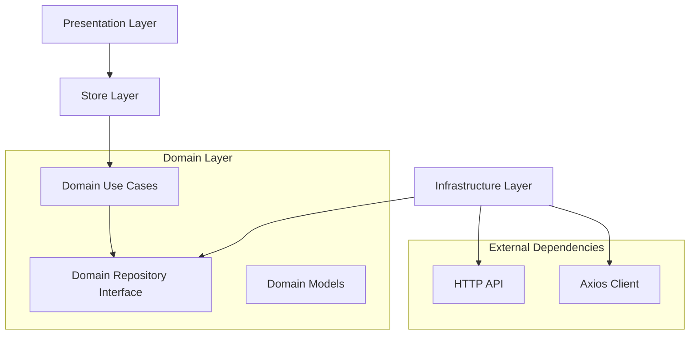

# Design Document

## Overview

This design implements a clean architecture pattern for the subscribers module in the Vue.js frontend application. The architecture separates concerns into four distinct layers: Domain (business logic), Infrastructure (external services), Presentation (UI components), and Store (state management). This approach ensures high testability, maintainability, and extensibility while following established patterns in the existing codebase.

> This design follows the Screaming Architecture principle: the folder structure reflects the business capability (`subscribers`) rather than technical concerns. All layers—domain, infrastructure, presentation, and store—are encapsulated inside the `subscribers/` directory, highlighting its role as a core business function of the application.

The design leverages dependency injection principles to decouple layers, making the system more flexible and easier to test. Each layer has specific responsibilities and communicates through well-defined interfaces.

## Architecture

### Folder Structure (Screaming Architecture)

```text
src/subscribers/
├── domain/
│   ├── models/           # Domain entities and value objects
│   ├── repositories/     # Abstract repository interfaces
│   └── usecases/        # Business logic use cases
├── infrastructure/
│   └── api/             # HTTP API implementations
├── presentation/
│   ├── components/      # Reusable UI components
│   └── views/          # Page-level components
└── store/              # Pinia state management
```

This structure emphasizes business modularity: all technical layers that serve the `subscribers` concern live inside the same bounded context directory. This helps enforce isolation, autonomy, and focus within business capabilities.

### Dependency Flow



## Components and Interfaces

### Domain Layer

#### Models (`domain/models/`)

**Subscriber.ts**

- Defines core domain entities: `Subscriber`, `SubscriberStatus`, `Attributes`
- Includes Zod schemas for validation: `subscriberSchema`
- Defines response types: `CountByStatusResponse`, `CountByTagsResponse`
- Provides type-safe interfaces independent of external APIs

#### Repository Interface (`domain/repositories/`)

**SubscriberRepository.ts**

```typescript
export interface SubscriberRepository {
  fetchAll(workspaceId: string, filters?: Record<string, string>): Promise<Subscriber[]>
  countByStatus(workspaceId: string): Promise<CountByStatusResponse[]>
  countByTags(workspaceId: string): Promise<CountByTagsResponse[]>
}
```

#### Use Cases (`domain/usecases/`)

**FetchSubscribers.ts**

- Encapsulates business logic for retrieving subscribers
- Depends only on `SubscriberRepository` interface
- Handles filtering and data transformation logic

**CountByStatus.ts**

- Manages subscriber counting by status
- Provides aggregated status information

**CountByTags.ts**

- Handles tag-based subscriber counting
- Manages tag aggregation logic

### Infrastructure Layer

#### API Implementation (`infrastructure/api/`)

**SubscriberApi.ts**

- Implements `SubscriberRepository` interface
- Uses existing axios instance with interceptors
- Handles HTTP request/response transformation
- Manages API endpoint construction and query parameters
- Transforms API responses to domain models

Key features:

- Leverages existing XSRF token handling from axios interceptors
- Uses workspace-based API endpoints following existing patterns
- Handles authentication through existing interceptor setup
- Provides proper error handling and transformation

### Presentation Layer

#### Components (`presentation/components/`)

**SubscriberList.vue**

- Reusable component for displaying subscriber data
- Receives data through props (no direct API calls)
- Implements proper TypeScript typing for props
- Uses Composition API with `<script setup lang="ts">` syntax
- Follows existing Vue conventions and styling patterns

#### Views (`presentation/views/`)

**SubscriberPage.vue**

- Page-level component that coordinates data flow
- Integrates with Pinia store for state management
- Handles user interactions and navigation
- Manages loading states and error handling

### Store Layer

### Note on Reusability and Isolation

All components and views in the `subscribers` folder are intended to be tightly coupled to this domain. Avoid reusing them across unrelated modules to preserve cohesion and domain boundaries. Shared logic or UI patterns should be abstracted into `@/components/ui` or a designated shared layer, if absolutely necessary.

#### Pinia Store (`store/`)

**subscriber.store.ts**

- Uses dependency injection for use case instances
- Manages reactive state for subscribers, loading, and errors
- Delegates business logic to domain use cases
- Follows existing Pinia patterns from auth store
- Provides proper TypeScript typing for all state and actions

## Data Models

### Core Domain Models

```typescript
interface Subscriber {
  readonly id: string
  readonly email: string
  readonly name?: string
  readonly status: SubscriberStatus
  readonly attributes?: Attributes
  readonly workspaceId: string
  readonly createdAt?: Date | string
  readonly updatedAt?: Date | string
}

enum SubscriberStatus {
  ENABLED = 'ENABLED',
  DISABLED = 'DISABLED',
  BLOCKLISTED = 'BLOCKLISTED'
}

interface Attributes {
  [key: string]: string | string[] | number | boolean
}
```

### API Response Models

```typescript
interface CountByStatusResponse {
  count: number
  status: string
}

interface CountByTagsResponse {
  count: number
  tag: string
}
```

## Error Handling

### Domain Layer Error Handling

- Use cases throw domain-specific errors
- Repository interface defines expected error types
- Business logic errors are separate from infrastructure errors

### Infrastructure Layer Error Handling

- API implementation catches HTTP errors
- Transforms infrastructure errors to domain errors
- Leverages existing axios interceptor error handling
- Provides meaningful error messages for business logic

### Presentation Layer Error Handling

- Components receive error state through props or store
- Views handle error display and user feedback
- Loading states managed through store actions

## Testing Strategy

### Unit Testing Approach

#### Domain Layer Tests

- **Use Cases**: Mock repository dependencies using Jest/Vitest mocks
- **Models**: Test validation schemas and type transformations
- **Repository Interface**: Test contract compliance

#### Infrastructure Layer Tests

- **API Implementation**: Mock axios responses using axios-mock-adapter
- **Integration Tests**: Test actual HTTP request/response cycles
- **Error Handling**: Test various HTTP error scenarios

#### Presentation Layer Tests

- **Components**: Use Vue Testing Library for component testing
- **Views**: Test user interactions and state management integration
- **Props/Events**: Test component communication patterns

#### Store Layer Tests

- **Actions**: Mock use case dependencies
- **State Management**: Test reactive state updates
- **Error States**: Test error handling and loading states

### Test Structure

```text
tests/
├── unit/
│   ├── domain/
│   │   ├── usecases/
│   │   └── models/
│   ├── infrastructure/
│   │   └── api/
│   ├── presentation/
│   │   ├── components/
│   │   └── views/
│   └── store/
└── integration/
    └── api/
```

### Coverage Requirements

- Minimum 90% code coverage for all layers
- 100% coverage for critical business logic (use cases)
- Integration tests for API endpoints
- Component interaction tests for presentation layer

## Implementation Considerations

### Dependency Injection Setup

- Use factory functions to create use case instances with injected dependencies
- Store initialization includes dependency injection configuration
- Maintain singleton pattern for repository implementations

### TypeScript Integration

- Strict typing throughout all layers
- Use of utility types for API transformations
- Proper generic typing for repository interfaces

### Vue.js Integration

- Follows existing Composition API patterns
- Integrates with current Pinia store structure
- Uses existing component styling and conventions

### Performance Considerations

- Lazy loading of use case instances
- Efficient state management with Pinia
- Proper reactive data handling
- Optimized component re-rendering

### Extensibility

- Easy addition of new use cases
- Simple repository implementation swapping
- Modular component structure
- Scalable store organization
