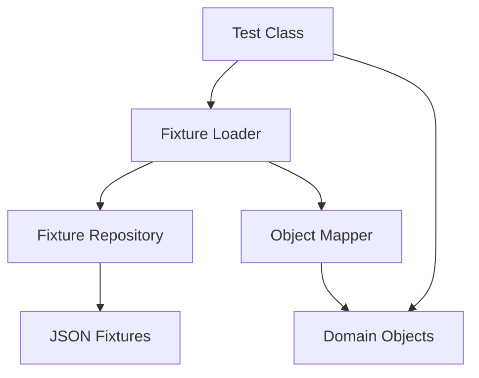

# Design Document: Test Fixtures Implementation

## Overview

This design document outlines the approach for implementing a test fixtures system that will allow developers to store test credentials and other test data in dedicated fixture files rather than hardcoding them in test source code. This will improve security by allowing security scanning tools to scan all source code while properly managing test data.

## Architecture

The test fixtures system will follow a layered architecture:

1. **Storage Layer**: JSON files stored in a dedicated fixtures directory
2. **Loading Layer**: Utilities for loading and deserializing fixture data
3. **Integration Layer**: Integration with test frameworks and test classes

### Component Diagram



## Components and Interfaces

### 1. Fixture Directory Structure

```test
server/thryve/src/test/resources/fixtures/
├── users/
│   ├── admin-user.json
│   ├── regular-user.json
│   └── test-users.json
├── authentication/
│   ├── tokens.json
│   └── credentials.json
└── configuration/
    └── test-config.json
```

### 2. Fixture Loader Interface

```kotlin
interface FixtureLoader {
    /**
     * Load a fixture file and deserialize it to the specified type
     */
    fun <T> load(path: String, type: Class<T>): T

    /**
     * Load a fixture file and deserialize it to the specified type reference
     * (for collections and generic types)
     */
    fun <T> load(path: String, typeReference: TypeReference<T>): T

    /**
     * Load a fixture file as a raw JSON node for custom processing
     */
    fun loadAsJsonNode(path: String): JsonNode
}
```

### 3. Fixture Repository

```kotlin
class FixtureRepository(private val fixtureLoader: FixtureLoader) {
    /**
     * Get a test user by predefined type
     */
    fun getTestUser(type: TestUserType): TestUser

    /**
     * Get test credentials by predefined type
     */
    fun getTestCredentials(type: TestCredentialType): TestCredentials

    /**
     * Get a collection of test users
     */
    fun getTestUsers(): List<TestUser>

    /**
     * Get test configuration
     */
    fun getTestConfig(): TestConfig
}
```

### 4. Test Data Models

```kotlin
data class TestUser(
    val id: UUID,
    val username: String,
    val email: String,
    val firstName: String,
    val lastName: String,
    val roles: List<String>
)

data class TestCredentials(
    val username: String,
    val password: String,
    val clientId: String? = null,
    val clientSecret: String? = null
)

enum class TestUserType {
    ADMIN,
    REGULAR,
    GUEST
}

enum class TestCredentialType {
    ADMIN,
    USER,
    CLIENT
}
```

## Data Models

### User Fixture Example

```json
{
  "id": "550e8400-e29b-41d4-a716-446655440000",
  "username": "john.doe",
  "email": "john.doe@example.com",
  "firstName": "John",
  "lastName": "Doe",
  "roles": ["ROLE_USER"]
}
```

### Credentials Fixture Example

```json
{
  "username": "john.doe@example.com",
  "password": "S3cr3tP@ssw0rd*123",
  "clientId": "web_app",
  "clientSecret": "web_app"
}
```

## Error Handling

1. **Missing Fixtures**: The system will provide clear error messages when fixtures are not found, including the expected path.
2. **Deserialization Errors**: When JSON cannot be deserialized to the expected type, detailed error messages will be provided.
3. **Invalid Fixture Data**: Validation will be performed on loaded fixtures to ensure they meet expected formats.

## Testing Strategy

1. **Unit Tests**: Test the fixture loading mechanism with mock fixture files.
2. **Integration Tests**: Ensure fixtures can be loaded in the context of Spring Boot tests.
3. **Validation Tests**: Verify that fixtures follow the expected format and contain required fields.

## Security Considerations

1. **Fixture Isolation**: Fixtures will be clearly marked as test data and isolated from production code.
2. **Gitleaks Configuration**: Update `.gitleaks.toml` to only exclude the fixtures directory, not all test code:

```toml
[allowlist]
# Only ignore generated fixtures; keep the rest of test code scanned
paths = ["server/thryve/src/test/resources/fixtures/.*\\.json$"]
```

3. **Naming Conventions**: All fixture files will follow naming conventions that clearly identify them as test data.
4. **Documentation**: Clear documentation will be provided on how to use the fixtures system securely.

## Implementation Plan

1. Create the fixtures directory structure
2. Implement the FixtureLoader interface and its implementation
3. Create the FixtureRepository class
4. Define test data models
5. Create sample fixture files
6. Update the `.gitleaks.toml` configuration
7. Update existing tests to use the fixtures system
8. Add documentation on how to use the fixtures system

## Alternatives Considered

1. **Environment Variables**: Using environment variables for test credentials was considered but rejected because it would make tests harder to run and would not provide a good solution for complex test data.
2. **In-Memory Database Seeding**: Dynamically generating test data was considered but would not solve the issue of having credentials in source code.
3. **Encrypted Fixtures**: Encrypting fixture files was considered but would add complexity without significant security benefits since the decryption key would still need to be stored somewhere.

## Open Questions

1. Should we provide a mechanism for overriding fixtures at runtime for specific tests?
2. How should we handle versioning of fixtures if the data model changes?
3. Should we integrate with Spring's TestPropertySource for seamless property loading?
