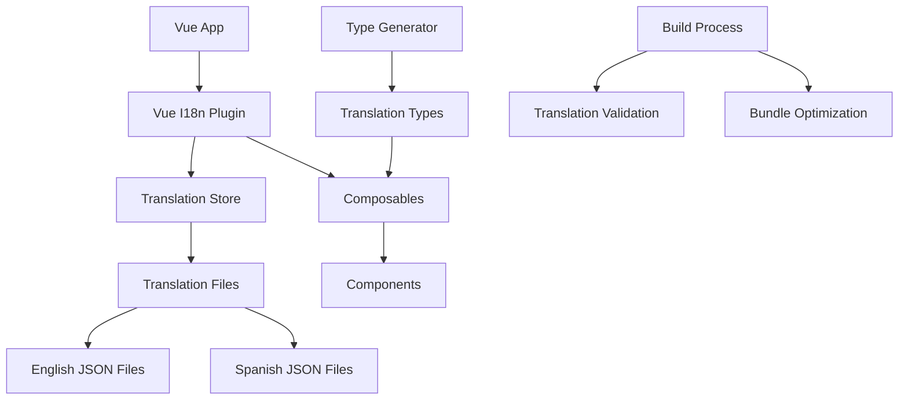

# Design Document

## Overview

The Vue.js web application currently has a broken internationalization (i18n) system where translation keys are displayed instead of translated text. The main issues identified are:

1. **Complex initialization flow** with multiple adapters and error handling that may be causing initialization failures
2. **Overly complex translation service** with unnecessary abstraction layers
3. **Missing TypeScript support** for translation keys
4. **No proper error handling** for missing translations in production
5. **Inefficient loading** of translation files

This design will simplify and optimize the i18n system using Vue I18n v11 best practices, improve maintainability, and ensure reliable translation loading.

## Architecture

### Current Issues Analysis

The current implementation has several problems:

- Complex adapter pattern between Vue I18n and custom service
- Async initialization that may fail silently
- Translation files loaded via dynamic imports that may not resolve correctly
- No TypeScript safety for translation keys
- Overly complex error handling that may prevent proper initialization

### Proposed Architecture



## Components and Interfaces

### 1. Simplified I18n Configuration

**File: `src/i18n/index.ts`**

- Single entry point for i18n configuration
- Simplified initialization without complex adapters
- Proper fallback handling
- TypeScript support

### 2. Translation Management System

**File: `src/i18n/loader.ts`**

- Efficient translation file loading
- Lazy loading for non-default languages
- Caching mechanism
- Error handling with fallbacks

### 3. Translation Store (Pinia)

**File: `src/stores/i18n.store.ts`**

- Centralized language state management
- Persistent language preferences
- Loading states
- Language switching logic

### 4. Translation Composables

**File: `src/composables/useTranslation.ts`**

- Simplified translation composable
- TypeScript-safe translation keys
- Formatting utilities
- Error handling

### 5. Type System

**File: `src/types/i18n.ts`**

- Generated TypeScript types for translation keys
- Nested key support
- Parameter validation

## Data Models

### Translation File Structure

```typescript
// Standardized translation file structure
// Refactored to use Record utility type for flexibility and maintainability
export type TranslationSchema = Record<string, string | TranslationSchema>;

// Example structure
// AppTranslations can be defined as an alias of TranslationSchema for simplicity
export type AppTranslations = TranslationSchema;
```

### Language Configuration

```typescript
interface LanguageConfig {
  code: string;
  name: string;
  flag: string;
  rtl?: boolean;
  dateFormat?: string;
  numberFormat?: Intl.NumberFormatOptions;
}

interface I18nConfig {
  defaultLanguage: string;
  fallbackLanguage: string;
  supportedLanguages: LanguageConfig[];
  loadPath: string;
  missingKeyHandler?: (key: string, locale: string) => string;
}
```

## Error Handling

### 1. Missing Translation Keys

```typescript
// Development mode: Show warning and return key
// Production mode: Return fallback or key silently

interface MissingKeyStrategy {
  development: 'warn' | 'error' | 'silent';
  production: 'fallback' | 'key' | 'silent';
}
```

### 2. Translation Loading Errors

```typescript
// Fallback chain: requested language -> fallback language -> English -> key
interface LoadingErrorStrategy {
  retryAttempts: number;
  fallbackChain: string[];
  cacheFailures: boolean;
}
```

### 3. Runtime Error Handling

```typescript
// Graceful degradation for translation errors
interface ErrorBoundary {
  catchTranslationErrors: boolean;
  fallbackRenderer: (key: string, params?: any) => string;
  errorReporter?: (error: Error, context: any) => void;
}
```

## Testing Strategy

### 1. Unit Tests

- **Translation Service Tests**: Test loading, caching, and error handling
- **Store Tests**: Test language switching and persistence
- **Composable Tests**: Test translation functions and type safety
- **Component Tests**: Test translation rendering in components

### 2. Integration Tests

- **Language Switching**: Test complete language switching flow
- **Fallback Behavior**: Test fallback chain when translations are missing
- **Persistence**: Test language preference persistence across sessions
- **SSR Compatibility**: Test server-side rendering with i18n

### 3. E2E Tests

- **User Language Preference**: Test browser language detection
- **Dynamic Language Switching**: Test UI language switching
- **Translation Coverage**: Test that all UI elements are translated
- **Accessibility**: Test screen reader compatibility with different languages

## Implementation Plan

### Phase 1: Core Infrastructure

1. Simplify i18n configuration and remove complex adapters
2. Implement efficient translation loading system
3. Create simplified translation store
4. Add proper error handling and fallbacks

### Phase 2: Developer Experience

1. Generate TypeScript types for translation keys
2. Create translation composables with type safety
3. Add development tools for missing translation detection
4. Implement translation validation in build process

### Phase 3: Performance & Production

1. Optimize translation bundle sizes
2. Implement lazy loading for non-default languages
3. Add translation caching strategies
4. Implement production error handling

### Phase 4: Advanced Features

1. Add pluralization support
2. Implement date/number formatting
3. Add RTL language support
4. Create translation management tools

## Key Design Decisions

### 1. Simplified Architecture

- **Decision**: Remove complex adapter pattern and use Vue I18n directly
- **Rationale**: Current abstraction adds complexity without clear benefits
- **Impact**: Easier maintenance, better performance, fewer bugs

### 2. TypeScript-First Approach

- **Decision**: Generate TypeScript types from translation files
- **Rationale**: Provides compile-time safety and better developer experience
- **Impact**: Prevents translation key typos, improves IDE support

### 3. Lazy Loading Strategy

- **Decision**: Load default language synchronously, others asynchronously
- **Rationale**: Improves initial load time while supporting multiple languages
- **Impact**: Faster app startup, better user experience

### 4. Centralized Error Handling

- **Decision**: Implement consistent error handling across all translation operations
- **Rationale**: Current implementation has inconsistent error handling
- **Impact**: More reliable application, better debugging experience

### 5. Build-Time Validation

- **Decision**: Validate translation completeness during build process
- **Rationale**: Catch missing translations before deployment
- **Impact**: Higher translation quality, fewer production issues
