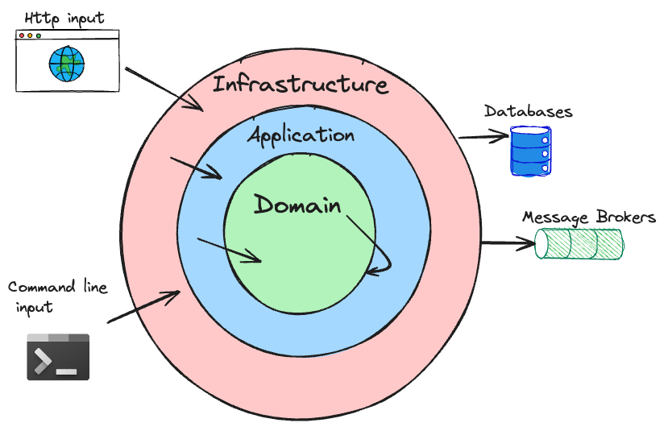
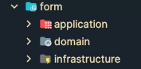

# Hexagonal Architecture



## Overview
Hexagonal Architecture, also known as Ports and Adapters, is a software design pattern that emphasizes the separation of concerns by isolating the core business logic from external systems. This architecture allows for easier testing, maintenance, and adaptability to changes in external dependencies.

## Key Concepts
- **Core Domain**: The central part of the application that contains the business logic. It is independent of external systems and frameworks.
- **Ports**: Interfaces that define how the core domain interacts with external systems. They can be inbound (for receiving commands) or outbound (for sending data).
- **Adapters**: Implementations of the ports that connect the core domain to external systems, such as databases, message queues, or web services. Adapters can be inbound (e.g., REST controllers) or outbound (e.g., repositories).
- **Dependency Inversion**: The core domain should not depend on external systems. Instead, it should define interfaces (ports) that adapters implement. This allows for easy replacement of external systems without affecting the core logic.
- **Testing**: The separation of the core domain from external systems allows for easier unit testing of business logic without needing to mock external dependencies. Integration tests can be used to verify the interaction between the core domain and adapters.
- **Flexibility**: The architecture allows for easy changes to external systems without impacting the core domain. New adapters can be added or existing ones modified without affecting the business logic.


## Clean Architecture in Hatchgrid

At Hatchgrid, we follow a strict Clean Architecture approach to enforce separation of concerns and long-term maintainability. This structure promotes testability, framework independence, and high cohesion within each feature or bounded context.

### Folder Structure

Each feature is self-contained and follows this standard structure:
```text
📁{feature}
├── 📁domain         // Core domain logic (pure Kotlin, no framework dependencies)
├── 📁application    // Use cases (pure, framework-agnostic)
└── 📁infrastructure // Framework integration (Spring Boot, R2DBC, HTTP, etc.)
```



### Layer Breakdown

#### 1. `domain`: The Core
- **Pure Kotlin**: No framework annotations or external dependencies.
- **Domain Building Blocks**:
  - **Value Objects**: Immutable objects that represent a descriptive aspect of the domain with no conceptual identity. For example:
    - `FormId`: A special value object that wraps a UUID and extends `BaseId<UUID>`.
    - `HexColor`: A validated string-based color value object extending `BaseValidateValueObject<String>`.
  - **Base Classes**:
    - `BaseId<T>`: Abstract class for typed IDs, ensuring type safety and consistent behavior.
    - `BaseValueObject<T>` and `BaseValidateValueObject<T>`: For defining immutable value objects with or without validation logic.
  - **Entities and Aggregate Roots**:
    - `Form`: A typical aggregate root extending `BaseEntity<FormId>`, responsible for business rules and recording domain events such as `FormCreatedEvent` and `FormUpdatedEvent`.
    - `BaseEntity<ID>`: Provides audit tracking and domain event management.
    - `AggregateRoot<ID>`: Marker base class to distinguish aggregate roots from regular entities.
  - **Domain Contracts**:
    - Defined through interfaces like `FormRepository`, `FormFinderRepository`, etc., which are implemented by adapters in the infrastructure layer.
  - **Domain Events**:
    - Encapsulate business-relevant occurrences like `FormCreatedEvent`, `FormUpdatedEvent`, etc., used to decouple the core from side effects.
  - **Domain Exceptions**:
    - Represent business-rule violations and are defined explicitly, e.g., `FormException`.
- **Entities, Value Objects, Events, Exceptions, and Interfaces** that define contracts with the outside.
- Example files: `Form.kt`, `FormId.kt`, `FormCreatedEvent.kt`, `FormRepository.kt`.

#### 2. `application`: Use Cases
- Defines **commands**, **queries**, and **handlers** (CQRS-style).
- Contains **services** that orchestrate interactions between domain logic and ports.
- Completely framework-independent. We even avoid `@Service` from Spring by defining our own annotation:

```kotlin
package com.hatchgrid.common.domain
@Retention(AnnotationRetention.RUNTIME)
@Target(AnnotationTarget.CLASS)
@MustBeDocumented
annotation class Service
```

- Example:
  - `CreateFormCommandHandler.kt` coordinates domain logic via `FormCreator.kt`.
  - `SearchFormsQueryHandler.kt` reads through `FormFinder.kt`.

- **CQRS (Command Query Responsibility Segregation)**:
  - The application layer implements CQRS by separating write and read concerns into `commands` and `queries`, each with their own handlers.
  - **Commands** represent state-changing operations. They are handled by classes implementing `CommandHandler<T>`:
    - Example: `CreateFormCommandHandler` receives a `CreateFormCommand`, authorizes the action, builds a domain object (`Form`), and delegates creation to `FormCreator`.
    - `FormCreator` persists the new entity via `FormRepository` and broadcasts relevant domain events (`FormCreatedEvent`) using an `EventPublisher`.
  - **Queries** represent read-only operations. They are handled by classes implementing `QueryHandler<TQuery, TResult>`:
    - Example: `FindFormQueryHandler` receives a `FindFormQuery`, fetches the entity via a `FormFinder`, and maps the result to a DTO (`FormResponse`).
  - All command and query objects are pure data structures implementing the shared `Command` or `Query<T>` interfaces, making them easy to validate, log, and trace.
  - Command and query handlers are marked with our custom `@Service` annotation to remain decoupled from Spring-specific logic.

#### 3. `infrastructure`: Adapters
- Implements the interfaces defined in `domain` and integrates with:
  - **HTTP layer**:
    - All controllers extend a shared base class `ApiController` that centralizes common logic:
      - Authentication via JWT (e.g., extracting user ID).
      - Input sanitization.
      - Dispatching commands or queries via a `Mediator`, which abstracts handler resolution.
    - Controllers are versioned via custom media types in the `Accept` header (e.g., `application/vnd.api.v1+json`).
    - Fully documented with **Swagger (OpenAPI v3)** annotations for automatic API documentation.
    - Example: `CreateFormController`, `FindFormController`.
  - **Persistence layer**:
    - Repositories and entities interact with the database using **Spring Data R2DBC**.
    - Mapping between domain and persistence models is done through dedicated mappers (e.g., `FormMapper.kt`).
    - Example: `FormR2dbcRepository` implements domain interfaces like `FormRepository`.

- This layer is the only one allowed to use framework-specific features (Spring annotations, I/O, etc.).

### Example Feature: `form`

```text
form/
├── application/
│   ├── create/
│   │   ├── CreateFormCommand.kt
│   │   ├── CreateFormCommandHandler.kt
│   │   └── FormCreator.kt
│   └── ...
├── domain/
│   ├── Form.kt
│   ├── FormId.kt
│   ├── FormRepository.kt
│   └── event/FormCreatedEvent.kt
└── infrastructure/
    ├── http/
    │   └── CreateFormController.kt
    └── persistence/
        ├── entity/FormEntity.kt
        └── repository/FormR2dbcRepository.kt
```

### Principles Applied
- **Single Responsibility per Layer**: Core logic, use cases, and adapters are strictly separated.
- **Framework Independence**: Core logic remains decoupled from Spring Boot or any infrastructure.
- **Port-Driven**: Infrastructure implements domain interfaces, not the other way around.
- **Isolation for Testing**: Domain and application layers can be unit-tested with no framework setup.
