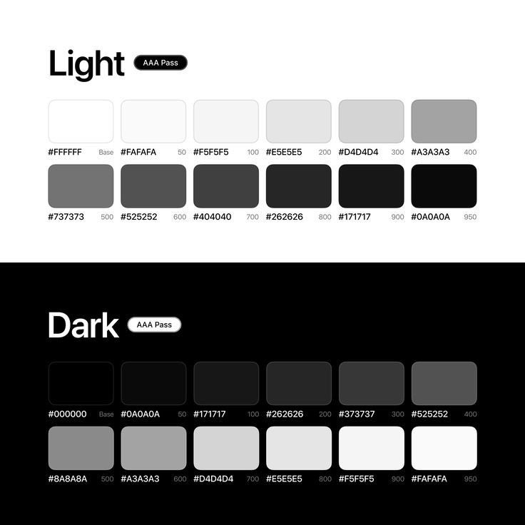

# Color Palette for Frontend Project

This color palette is tailored for a frontend project, offering a consistent and accessible color scheme for both light and dark themes. All colors meet **AAA accessibility standards** for text contrast, ensuring readability and usability across your application's interfaces.

---

## Light Theme

The light theme provides a range of grays from pure white to nearly black, perfect for backgrounds, text, and UI components.

- **Base**: `#FFFFFF` - Pure white, ideal for backgrounds.
- **50**: `#FAFAFA` - Very light gray, great for subtle background variations.
- **100**: `#F5F5F5` - Light gray, suitable for hover states or borders.
- **200**: `#E5E5E5` - Medium light gray, useful for dividers or secondary text.
- **300**: `#D4D4D4` - Medium gray, good for tertiary text or icons.
- **400**: `#A3A3A3` - Darker gray, ideal for primary text or accents.
- **500**: `#737373` - Medium dark gray, perfect for headings or emphasis.
- **600**: `#525252` - Dark gray, strong choice for emphasis or shadows.
- **700**: `#404040` - Very dark gray, great for deep shadows or outlines.
- **800**: `#262626` - Nearly black, excellent for high-contrast elements.
- **900**: `#171717` - Dark black, provides maximum contrast.
- **950**: `#0A0A0A` - Pure black, use sparingly for text or icons.

---

## Dark Theme

The dark theme mirrors the light theme, transitioning from pure black to white, ensuring a cohesive dark mode experience.

- **Base**: `#000000` - Pure black, perfect for backgrounds.
- **50**: `#0A0A0A` - Very dark gray, subtle background variations.
- **100**: `#171717` - Dark gray, works well for hover states or borders.
- **200**: `#262626` - Medium dark gray, ideal for dividers or secondary text.
- **300**: `#373737` - Medium gray, suitable for tertiary text or icons.
- **400**: `#525252` - Light gray, great for primary text or accents.
- **500**: `#8A8A8A` - Medium light gray, good for headings or emphasis.
- **600**: `#A3A3A3` - Light gray, strong for emphasis or highlights.
- **700**: `#D4D4D4` - Very light gray, brightens elements effectively.
- **800**: `#E5E5E5` - Off-white, excellent for high-contrast text.
- **900**: `#F5F5F5` - Near-white, ensures maximum contrast for text.
- **950**: `#FAFAFA` - Pure white, use sparingly for highlights.

---

**Note**: All colors in this palette comply with **AAA accessibility standards** for text contrast, guaranteeing that text remains legible against background colors.
