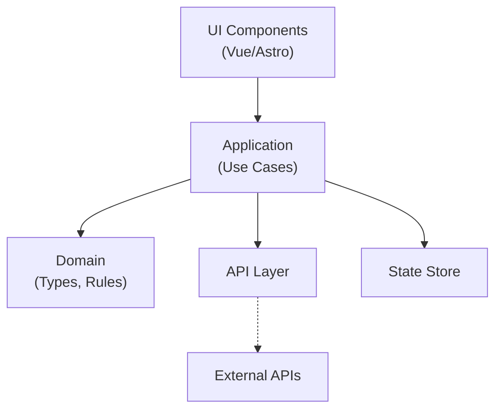

# 🏗️ Frontend Architecture

This document describes the frontend architecture for Hatchgrid, combining **Screaming Architecture** with **Hexagonal principles**, adapted to a Vue + Astro setup with `vue-shadcn` components.

## 📐 Overview

We use a **feature-first structure**: every top-level folder under `src/` represents a business domain or feature (e.g., `subscribers/`, `publications/`). Inside each feature, we apply Hexagonal layering (`domain`, `application`, `infrastructure`), without explicitly naming "ports" or "adapters".

```text
src/
├── subscribers/
│   ├── domain/            # Business types, exceptions
│   ├── application/       # Use cases (pure logic)
│   └── infrastructure/    # APIs, stores, routing
├── publications/
│   └── ...
├── components/
│   └── ui/                # Common UI components from vue-shadcn
├── layouts/               # Layout templates (DefaultLayout.vue, etc.)
├── router/                # App-level router config
├── App.vue
└── main.ts
```

## 🧠 Architectural Principles

- **Feature isolation**: Each domain (e.g., `subscribers`) is self-contained and testable.
- **Hexagonal layering**: Domain logic is decoupled from framework or UI concerns.
- **No explicit ports/adapters**: File names and locations imply intent.
- **UI truth lives in `components/ui/`**: All base components come from `vue-shadcn`.

## 🎯 Feature Module Structure Example

```text
subscribers/
├── __tests__/
├── application/
│   ├── composables/
│   └── index.ts
├── domain/
│   ├── models/
│   ├── repositories/
│   └── usecases/
├── infrastructure/
│   ├── api/
│   ├── di/
│   ├── routing/
│   ├── store/
│   └── views/
├── di.ts
└── index.ts
```

### 🧩 How It Works



## 🧪 Testing Strategy

- **domain/** and **application/**: Pure unit tests, no mocks or DOM needed.
- **infrastructure/**: Integration tests for API calls and state handling.
- **ui/** and pages: Component tests with Testing Library.

---
