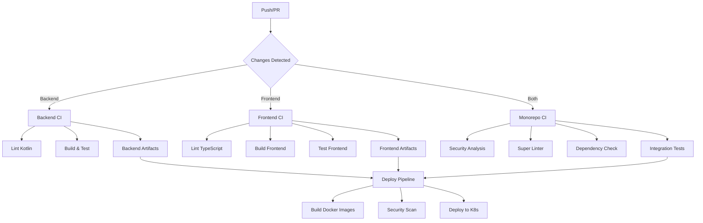

# 📚 Workflows Documentation - Hatchgrid

Welcome to the complete documentation for Hatchgrid's CI/CD workflows. This section contains all the information needed to understand, maintain, and extend our GitHub Actions pipelines.

---

## 📋 Documentation Index

<details>
<summary>Click to expand documentation links</summary>

### 🚀 Main Documentation

- **[CI/CD Guide](./ci-guide.md)** - Complete guide for the main monorepo workflow
- **[GitHub Actions Overview](github-actions-workflows.md)** - Overview of all workflows
- **[Custom Actions](./custom-actions.md)** - Documentation for composite actions
- **[Git Hooks](./git-hooks.md)** - Documentation for Git hooks with Lefthook

### 🔧 Technical Documentation

- **[Configuration and Troubleshooting](./configuration-troubleshooting.md)** - Problem resolution and optimization
</details>

---

## 🏗️ CI/CD Architecture



---

## 🔄 Available Workflows

### Main Workflows

| Workflow | Purpose | Triggers | Approx. Duration |
|----------|---------|----------|------------------|
| **Monorepo CI** | Main CI/CD pipeline | Push/PR to main, Manual | ~15-20 min |
| **Backend CI** | Kotlin/Java specific CI | Changes in server/ | ~8-12 min |
| **Frontend CI** | Node.js/TS specific CI | Changes in client/ | ~5-8 min |
| **Deploy** | Environment deployment | Manual, Tags, Push main | ~10-15 min |

### Support Workflows

| Workflow | Purpose | Triggers | Frequency |
|----------|---------|----------|-----------|
| **Cleanup Cache** | Cache cleanup | PR closed | Automatic |
| **Issue Labeler** | Issue labeling | Issue opened/edited | Automatic |
| **Semantic PR** | PR title validation | PR opened/edited | Automatic |
| **Test PNPM** | Configuration verification | Manual | As needed |

---

## 🔧 Custom Actions

### Available Composite Actions

| Action | Purpose | Usage | Benefits |
|--------|---------|-------|----------|
| **setup-java** | Java 21 + Gradle configuration | Backend workflows | Automatic cache, consistent configuration |
| **setup-node** | Node.js 22 + pnpm configuration | Frontend workflows | Smart caching, optimized installation |
| **docker/backend** | Spring Boot Docker build | Deploy workflows | Gradle bootBuildImage, security scanning |
| **docker/frontend-web** | Vue.js Docker build | Deploy workflows | Multi-stage builds, environment configs |
| **docker/frontend-landing** | Astro Docker build | Deploy workflows | Static site optimization, security scanning |
| **docker/security-scan** | Docker vulnerability scanning | All Docker builds | Trivy integration, SARIF reports |

---

## 📊 Metrics and Performance

### Typical Execution Times

- **Cache Hit**: 85-95% (depending on workflow)
- **Total CI Time**: ~20-25 minutes (without cache)
- **Total CI Time**: ~8-12 minutes (with cache)
- **Deploy Time**: ~10-15 minutes

### Resources Used

- **Runners**: Ubuntu Latest (GitHub-hosted)
- **Concurrency**: Maximum 20 simultaneous jobs
- **Storage**: ~2GB artifacts per month
- **Bandwidth**: ~50GB transfer per month

---

## 🔒 Security and Compliance

### Implemented Security Analysis

- **CodeQL** - Static code analysis (JavaScript, Kotlin)
- **OWASP Dependency Check** - Dependency vulnerabilities
- **Trivy** - Docker image scanning
- **Dependency Review** - New dependency review in PRs
- **Super Linter** - Code and configuration validation

### Secrets and Variables

- **Repository Level**: Shared secrets (Codecov, NVD API)
- **Environment Level**: Environment-specific configurations (Kubernetes, APIs)
- **Rotation**: Monthly automatic rotation for critical secrets

---

## 🚀 Quick Start Guides

### For Developers

#### First Setup

1. Clone the repository
2. Workflows run automatically on PRs
3. Review checks before merging
4. Deploys to development are automatic from main

#### Workflow Debugging

1. Review logs in the "Actions" tab
2. Use [act](https://github.com/nektos/act) for local testing
3. Consult the [troubleshooting guide](./configuration-troubleshooting.md)

### For DevOps

#### Regular Maintenance

1. **Weekly**: Review metrics and cache hit rates
2. **Monthly**: Update action versions
3. **Quarterly**: Complete security audit

#### Adding New Workflow

1. Create file in `.github/workflows/`
2. Follow naming conventions
3. Document in this guide
4. Test in development branch

---

## 🛠️ Tools and Utilities

### CLI Tools

```bash
# GitHub CLI for workflow management
gh workflow list
gh workflow run "Monorepo CI"
gh run list --workflow="Deploy"

# Secret management
gh secret list
gh secret set SECRET_NAME --body "value"

# Cache management
gh extension install actions/gh-actions-cache
gh actions-cache list
```

### Local Development

```bash
# Run workflows locally with act
act -j backend
act -j frontend
act --workflows .github/workflows/monorepo-ci.yml

# Validate workflow syntax
actionlint .github/workflows/*.yml
```

---

## 📈 Roadmap and Future Improvements

### Q1 2025

- [ ] Implement matrix builds for multiple versions
- [ ] Optimize cache strategy for better hit rate
- [ ] Add Slack/Teams notifications

### Q2 2025

- [ ] Migrate to self-hosted runners for intensive workloads
- [ ] Implement canary deployment
- [ ] Add post-deployment smoke tests

### Q3 2025

- [ ] Implement GitOps with ArgoCD
- [ ] Add automatic performance analysis
- [ ] Implement automatic rollback

---

## 🤝 Contributing

### How to Contribute to Documentation

1. Fork the repository
2. Create documentation branch: `docs/update-workflows`
3. Update relevant files
4. Create PR with clear description
5. Request review from DevOps team

### Documentation Conventions

- Use emojis for main sections
- Include code examples when relevant
- Keep links updated
- Document changes in CHANGELOG

---

## 📞 Support

### Contacts

- **DevOps Team**: <devops@hatchgrid.com>
- **Slack Channel**: #ci-cd
- **Issues**: [GitHub Issues](https://github.com/hatchgrid/hatchgrid/issues)

### External Resources

- [GitHub Actions Documentation](https://docs.github.com/en/actions)
- [Kubernetes Documentation](https://kubernetes.io/docs/)
- [Docker Best Practices](https://docs.docker.com/develop/dev-best-practices/)

---

## 📝 Changelog

### 2025-01-16

- ✅ Complete initial documentation
- ✅ Troubleshooting guides
- ✅ Custom actions documentation
- ✅ Metrics and monitoring

### Upcoming Updates

- [ ] Technology-specific guides
- [ ] Tutorial videos
- [ ] Workflow templates
- [ ] Documentation automation

---

*Last updated: January 16, 2025*
*Documentation version: 1.0.0*
